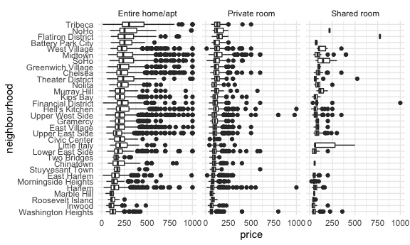
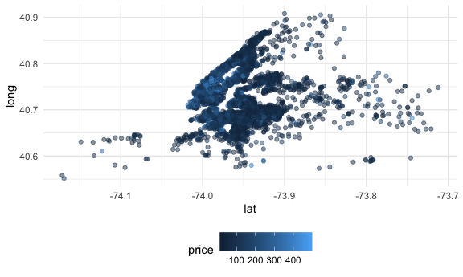

case study
================

The thing we start all files with:

## Load a dataset

``` r
data("nyc_airbnb")

#View data
str(nyc_airbnb)
```

    ## spec_tbl_df [40,753 × 17] (S3: spec_tbl_df/tbl_df/tbl/data.frame)
    ##  $ id                            : num [1:40753] 7949480 16042478 1886820 6627449 5557381 ...
    ##  $ review_scores_location        : num [1:40753] 10 NA NA 10 10 10 10 9 10 9 ...
    ##  $ name                          : chr [1:40753] "City Island Sanctuary relaxing BR & Bath w Parking" "WATERFRONT STUDIO APARTMENT" "Quaint City Island Community." "Large 1 BDRM in Great location" ...
    ##  $ host_id                       : num [1:40753] 119445 9117975 9815788 13886510 28811542 ...
    ##  $ host_name                     : chr [1:40753] "Linda & Didier" "Collins" "Steve" "Arlene" ...
    ##  $ neighbourhood_group           : chr [1:40753] "Bronx" "Bronx" "Bronx" "Bronx" ...
    ##  $ neighbourhood                 : chr [1:40753] "City Island" "City Island" "City Island" "City Island" ...
    ##  $ lat                           : num [1:40753] -73.8 -73.8 -73.8 -73.8 -73.8 ...
    ##  $ long                          : num [1:40753] 40.9 40.9 40.8 40.8 40.9 ...
    ##  $ room_type                     : chr [1:40753] "Private room" "Private room" "Entire home/apt" "Entire home/apt" ...
    ##  $ price                         : num [1:40753] 99 200 300 125 69 125 85 39 95 125 ...
    ##  $ minimum_nights                : num [1:40753] 1 7 7 3 3 2 1 2 3 2 ...
    ##  $ number_of_reviews             : num [1:40753] 25 0 0 12 86 41 74 114 5 206 ...
    ##  $ last_review                   : Date[1:40753], format: "2017-04-23" NA ...
    ##  $ reviews_per_month             : num [1:40753] 1.59 NA NA 0.54 3.63 2.48 5.43 2.06 5 2.98 ...
    ##  $ calculated_host_listings_count: num [1:40753] 1 1 1 1 1 1 1 4 3 4 ...
    ##  $ availability_365              : num [1:40753] 170 180 365 335 352 129 306 306 144 106 ...

``` r
nyc_airbnb %>%
  count(room_type)
```

    ## # A tibble: 3 × 2
    ##   room_type           n
    ##   <chr>           <int>
    ## 1 Entire home/apt 19937
    ## 2 Private room    19626
    ## 3 Shared room      1190

``` r
nyc_airbnb %>%
  count(neighbourhood_group)
```

    ## # A tibble: 5 × 2
    ##   neighbourhood_group     n
    ##   <chr>               <int>
    ## 1 Bronx                 649
    ## 2 Brooklyn            16810
    ## 3 Manhattan           19212
    ## 4 Queens               3821
    ## 5 Staten Island         261

-   How many rentals are there? what type? Where?
-   Is price correlated with review score?
-   Which neighborhood is most popular? Most expensive?
-   Which neighborhood has highest reviews?
-   Is availability related to price?
-   Is room type related to neighborhood?
-   Is length of stay related to neighborhood group (borough)?

``` r
nyc_airbnb = 
  nyc_airbnb %>% 
  mutate(stars = review_scores_location/2) %>% 
  rename (borough = neighbourhood_group)
```

Let’s count things:

``` r
nyc_airbnb %>% 
  janitor::tabyl(borough, room_type)
```

    ##        borough Entire home/apt Private room Shared room
    ##          Bronx             192          429          28
    ##       Brooklyn            7427         9000         383
    ##      Manhattan           10814         7812         586
    ##         Queens            1388         2241         192
    ##  Staten Island             116          144           1

We get the same table and it may be easier to get other info if we do it
this way:

``` r
nyc_airbnb %>% 
  count(borough, room_type) %>% 
  pivot_wider(
    names_from = room_type,
    values_from = n
  )
```

Let’s look at price and room type …

``` r
nyc_airbnb %>% 
  ggplot(aes(x = stars, y = price)) +
  geom_point() +
  facet_grid(. ~ room_type)
```

    ## Warning: Removed 10037 rows containing missing values (geom_point).


Price and neighbourhood

``` r
nyc_airbnb %>% 
  filter(borough == "Manhattan") %>% 
  group_by(neighbourhood) %>% 
  summarize(mean_price = mean(price, na.rm = TRUE)) %>% 

arrange(mean_price)
```

    ## # A tibble: 32 × 2
    ##    neighbourhood       mean_price
    ##    <chr>                    <dbl>
    ##  1 Marble Hill               83.6
    ##  2 Inwood                    86.5
    ##  3 Washington Heights        90.1
    ##  4 Morningside Heights      107. 
    ##  5 Harlem                   117. 
    ##  6 Roosevelt Island         122. 
    ##  7 Two Bridges              123. 
    ##  8 East Harlem              128. 
    ##  9 Chinatown                158. 
    ## 10 Upper East Side          172. 
    ## # … with 22 more rows

``` r
nyc_airbnb %>% 
  filter(borough == "Manhattan", price <= 1000) %>% 
  mutate(neighbourhood = 
           fct_reorder(neighbourhood, price)) %>% 
  ggplot(aes(x = neighbourhood, y = price)) +
  geom_boxplot() +
  coord_flip() +
  facet_grid(. ~ room_type)
```



Look at that coord flip!

Price vs location

*using `sample_n` because it’s a huge dataset*

``` r
nyc_airbnb %>% 
  filter(price < 500) %>% 
  sample_n(5000) %>% 
  ggplot(aes(x = lat, y = long, color = price)) +
  geom_point(alpha = 0.5)
```



## retry leaflet

We want to make a map because to use the previous one, you have to know
what NYC looks like. Leaflet is a handy tool with a dataframe for maps.

``` r
library(leaflet)

nyc_airbnb %>% 
  leaflet() %>% 
  addTiles() %>% 
  addMarkers(~lng, ~long)
```
